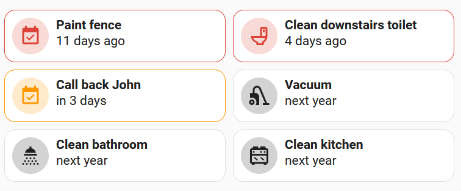

# Grocy Tasks and Chores Card

Forking to see about adding more actions during button press, rather than just closing the task or refreshing the chore.
e.g. change assignee


[](https://www.buymeacoffee.com/rudygnodde)

Custom Home Assistant card for displaying tasks and chores from Grocy. This card requires the [custom Grocy integration](https://github.com/custom-components/grocy) to be installed in Home Assistant.



## Table of Content

- [Installation](#installation)
  - [HACS (Recommended)](#hacs-recommended)
  - [Manual](#manual)
- [Configuration](#configuration)
  - [Main options](#main-options)
  - [Entities](#entities)
  - [Icon mapping](#icon-mapping)
  - [Texts](#texts)
- [Custom styling using cardmod](#custom-styling-using-cardmod)
- [Examples](#examples)

## Installation

### HACS (Recommended)

1. Make sure [HACS](https://hacs.xyz) is installed and working.
2. Make sure the [custom Grocy integration](https://github.com/custom-components/grocy) is installed and working.
3. Add this repository (https://github.com/FamousWolf/grocy-tasks-chores) via [HACS Custom repositories](https://hacs.xyz/docs/faq/custom_repositories). Type should be `Dashboard`.
4. Download and install using HACS.

### Manual

1. Make sure the [custom Grocy integration](https://github.com/custom-components/grocy) is installed and working.
2. Download and copy `grocy-tasks-chores.js` from the [latest release](https://github.com/FamousWolf/grocy-tasks-chores/releases/latest) into your `config/www` directory.
3. Add the resource reference to Home Assistant configuration using one of these methods:
  - **Edit your configuration.yaml**
    Add:
    ```yaml
    resources:
      - url: /local/grocy-tasks-chores.js?version=1.1.1
    type: module
    ```
  - **Using the graphical editor**
    1. Make sure advanced mode is enabled in your user profile
    2. Navigate to "Settings" -> "Dashboards".
    3. Click on the 3 vertical dots in the top right corner and select "Resources".
    4. Click on the "Add resource" button in the bottom right corner.
    5. Enter URL `/local/grocy-tasks-chores.js` and select type "JavaScript Module".
    6. Restart Home Assistant.


## Configuration

### Main Options

| Name                   | Type    | Default              | Supported options                                                                  | Description                                                             | Version |
|------------------------|---------|----------------------|------------------------------------------------------------------------------------|-------------------------------------------------------------------------|---------|
| `type`                 | string  | **Required**         | `custom:grocy-tasks-chores`                                                        | Type of the card                                                        | 1.0.0   |
| `title`                | string  | optional             | Any string                                                                         | Card title                                                              | 1.0.0   |
| `entity`               | object  | **Required**         | See [Entities](#entities)                                                          | Entities used for this card                                             | 1.0.0   |
| `sort`                 | string  | `date desc`          | `date asc` \| `date desc` \| `name asc` \| `name desc`                             | Order of the tasks and chores                                           | 1.0.0   |
| `columns`              | number  | 2                    | Any integer number                                                                 | Number of columns                                                       | 1.0.0   |
| `layout`               | string  | `horizontal`         | `horizontal` \| `vertical`                                                         | Layout                                                                  | 1.0.0   |
| `wrapName`             | boolean | false                | true \| false                                                                      | Wrap name                                                               | 1.0.0   |
| `showDescription`      | boolean | false                | true \| false                                                                      | Show description                                                        | 1.0.0   |
| `wrapDescription`      | boolean | false                | true \| false                                                                      | Wrap description                                                        | 1.0.0   |
| `showDueDate`          | boolean | true                 | true \| false                                                                      | Show due date                                                           | 1.0.0   |
| `wrapDueDate`          | boolean | false                | true \| false                                                                      | Wrap due date                                                           | 1.0.0   |
| `showDueDateLabel`     | boolean | true                 | true \| false                                                                      | Show due date label                                                     | 1.0.0   |
| `showLastDate`         | boolean | false                | true \| false                                                                      | Show last date                                                          | 1.0.0   |
| `wrapLastDate`         | boolean | false                | true \| false                                                                      | Wrap last date                                                          | 1.0.0   |
| `showLastDateLabel`    | boolean | true                 | true \| false                                                                      | Show last date label                                                    | 1.0.0   |
| `showUser`             | boolean | false                | true \| false                                                                      | Show user                                                               | 1.0.0   |
| `wrapUser`             | boolean | false                | true \| false                                                                      | Wrap user                                                               | 1.0.0   |
| `showUser`             | boolean | true                 | true \| false                                                                      | Show user label                                                         | 1.0.0   |
| `showTypeIcon`         | boolean | true                 | true \| false                                                                      | Show type icon                                                          | 1.0.0   |
| `taskIcon`             | string  | `mdi:calendar-check` | Any icon                                                                           | Task icon                                                               | 1.0.0   |
| `choreIcon`            | string  | `mdi:vacuum`         | Any icon                                                                           | Chore icon                                                              | 1.0.0   |
| `iconMapping`          | object  | optional             | See [Icon mapping](#icon-mapping)                                                  | Icon mapping                                                            | 1.0.0   |
| `locale`               | string  | `en`                 | Any locale                                                                         | Locale used for date format                                             | 1.0.0   |
| `dateFormat`           | string  | `d LLLL yyyy`        | See [Luxon format](https://moment.github.io/luxon/#/formatting?id=table-of-tokens) | Format of the date                                                      | 1.0.0   |
| `timeFormat`           | string  | `HH:mm`              | See [Luxon format](https://moment.github.io/luxon/#/formatting?id=table-of-tokens) | Format of the time                                                      | 1.0.0   |
| `relativeDateDays`     | number  | 14                   | Any integer number                                                                 | Number of days to show relative time                                    | 1.0.0   |
| `almostDueDays`        | number  | 3                    | Any integer number                                                                 | Number of days remaining before a task or chore is marked as almost due | 1.0.0   |
| `dueDays`              | number  | 0                    | Any integer number                                                                 | Number of days remaining before a task or chore is marked as due        | 1.0.0   |
| `userId`               | number  | 0                    | Any integer number                                                                 | User id to use when communicating with Grocy                            | 1.0.0   |
| `hideNotDue`           | boolean | false                | true \| false                                                                      | Hide tasks and chores that are not due or almost due                    | 1.0.0   |
| `hideAlmostDue`        | boolean | false                | true \| false                                                                      | Hide tasks and chores that are almost due                               | 1.0.0   |
| `hideDue`              | boolean | false                | true \| false                                                                      | Hide tasks and chores that are due                                      | 1.0.0   |
| `filterUsers`          | string  | optional             | Comma separated list of integer numbers                                            | Only show tasks and chores assigned to these user id's                  | 1.0.0   |
| `filterTaskCategories` | string  | optional             | Comma separated list of integer numbers                                            | Only show tasks with these category id's (0 is no category)             | 1.1.0   |
| `texts`                | object  | optional             | See [Texts](#texts)                                                                | Override texts                                                          | 1.0.0   |

### Entities

| Name     | Type   | Default  | Supported options     | Description       | Version |
|----------|--------|----------|-----------------------|-------------------|---------|
| `tasks`  | string | optional | `sensor.grocy_tasks`  | Entity for tasks  | 1.0.0   |
| `chores` | string | optional | `sensor.grocy_chores` | Entity for chores | 1.0.0   |

### Icon mapping

You can map task and chore id's to show a specific icon instead of the default task icon. For example:

```yaml
iconMapping:
  chore:
    "3": mdi:shower-head
    "4": mdi:toilet
  task:
    "1": mdi:hammer
```

Icon mapping is currently only possible by editing the YAML code, not using the visual editor. 

### Texts

| Name   | Type   | Default                    | Supported options | Description                                         | Version |
|--------|--------|----------------------------|-------------------|-----------------------------------------------------|---------|
| `due`  | string | `Due:`                     | Any text          | Due date label                                      | 1.0.0   |
| `last` | string | `Last:`                    | Any text          | Last date label                                     | 1.0.0   |
| `user` | string | `User:`                    | Any text          | User name label                                     | 1.0.0   |
| `none` | string | `No tasks or chores found` | Any text          | Text shown when there are no tasks and chores found | 1.0.0   |

## Custom styling using cardmod

Like with most cards, you can add custom styling to this card using [card_mod](https://github.com/thomasloven/lovelace-card-mod). To make it easier to add custom styles to tasks and chores, there are several classes that tasks and chores can have. Additionally, there are data attributes you can use in CSS selectors.

### Task/chore classes

| Class        | Description                             | Version |
|--------------|-----------------------------------------|---------|
| `task-task`  | It is a task                            | 1.0.0   |
| `task-chore` | It is a chore                           | 1.0.0   |
| `due`        | It is due                               | 1.0.0   |
| `almostDue`  | It is almost due                        | 1.0.0   |
| `tapped`     | It has been tapped, but not updated yet | 1.0.0   |

### Task/chore data attributes

| Data attribute       | Description   | Version |
|----------------------|---------------|---------|
| `data-type`          | Type          | 1.0.0   |
| `data-name`          | Name          | 1.0.0   |
| `data-description`   | Description   | 1.0.0   |
| `data-due-date`      | Due date      | 1.0.0   |
| `data-last-date`     | Last date     | 1.0.0   |
| `data-user-id`       | User id       | 1.0.0   |
| `data-user-username` | User username | 1.0.0   |
| `data-user-name`     | User name     | 1.0.0   |

## Examples

### Minimal

```yaml
type: custom:grocy-tasks-chores
entity:
  tasks: sensor.grocy_tasks
  chores: sensor.grocy_chores
```

### With icon mapping

```yaml
type: custom:grocy-tasks-chores
entity:
  tasks: sensor.grocy_tasks
  chores: sensor.grocy_chores
iconMapping:
  chore:
    "3": mdi:shower-head
    "4": mdi:toilet
  task:
    "1": mdi:hammer
```

### Single column
```yaml
type: custom:grocy-tasks-chores
entity:
  tasks: sensor.grocy_tasks
  chores: sensor.grocy_chores
columns: 1
```

### Only show due tasks/chores assigned to certain users

```yaml
type: custom:grocy-tasks-chores
entity:
  tasks: sensor.grocy_tasks
  chores: sensor.grocy_chores
hideNotDue: true
hideAlmostDue: true
filterUsers: 1,2
```
